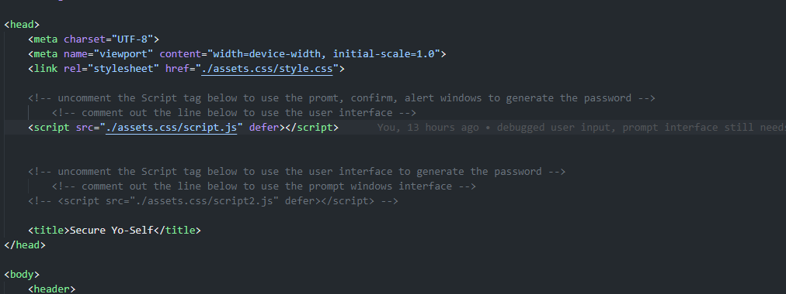

# Secure Yo-Self
password generator

This password generator comes in two flavors. By commenting and uncommenting Script Tags in the Head section of the HTML you can select the version you will use. 

# Prompt Box Version

This Version uses prompt, alert, and confirm boxes for the inputs to generate the password. to use this version uncomment the script tag for "Script.JS"

# User Input Version

This version uses a user input form which includes a slider, text input and check boxes to gather the data for the generator.  

# About this project   

The thought to use ASCII came from watching some videos on Harvard's CS50 class on YouTube. during the video the presentor brought up the idea of using ASCII 
for various text encryption schemes. Since learning about ASCII this project seemed like the perfect place to use the concept.

# Special Thanks
this project has been filled with many challenges and would not have been possible without the support of the following people.

Dru Sanchez - Tutor
Rich Widtmann - instructor

not to mention numorous posts on Stack Overflow, W3Schools.com, MDN Docs, and many other resources. 

